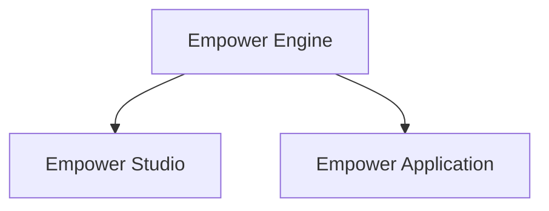

## An easy to use engine for visual no code programming

## Introduction

Empower's goal is to make complex programming intuitive and easy to understand for both advanced and beginner developers. 

Empower follows a game engine architecture, split into 3 separate modules. Empower Engine is the baseline library, which is used in both Empower Studio & Empower Application. Via Empower Studio, the user gets a GUI surface to easily modify Empower projects and, when finished, export the project to an Empower Application. Empower Application is the executable / directory that will be transferred to run on the target machine.

- Empower Engine: The baseline library used by studio and application.
  - Node Graphs
  - Assets
  - Projects
  - Compiler
  - File handling
  - Execution
  - Distribution / Exporting
  - Logging
 
- Empower Studio: Developer frontend, giving a user- and GUI-friendly way of interacting with projects 
  - Immediate mode GUI
  - Docking & Windows
  - Project Editor
  - Export editor
  - Caching & Layouts
  - Visual logging

- Empower Application: Runtime executable, meant to run on the target machine.
  - Compiler runtime execution
  - CLI & GUI support (in development)
  - Multi-platform target support (Linux, Mac, Windows)

## Getting started

### Prerequisite
Make sure to have the rust toolchain running on your system

https://rust-lang.org/tools/install/

### Building

The project is built using Rust Cargo.

Clone the repository in your system
~~~
git clone <git_url> && cd empower
~~~

Build using cargo (it is recommended to do this before running Empower Studio, otherwise, there will be no runtime export)
~~~
cargo build
~~~

Run Empower Studio (the visual editor) with
~~~
cargo run -p empower-studio
~~~
