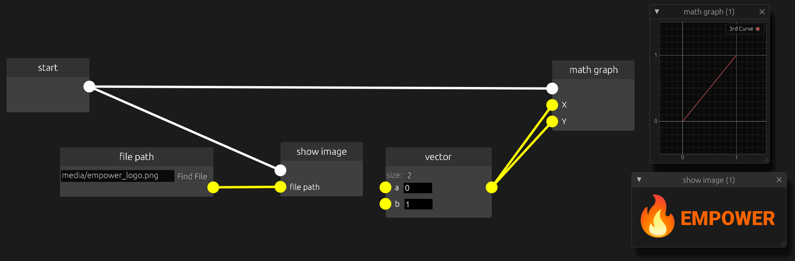

# An easy to use engine for visual no code programming

## Getting started

### Prerequisite
Make sure to have the rust toolchain running on your system

https://rust-lang.org/tools/install/

### Building

The project is build using rust cargo.

Clone repository in your system
~~~
git clone <git_url> && cd empower
~~~

Build using cargo
~~~
cargo build
~~~

Open empower studio (the visual editor) with
~~~
cargo run -p empower-studio
~~~
